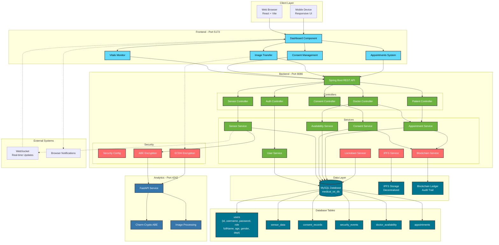

# Medical IoT System - Secure Health Monitoring Platform

A comprehensive, decentralized health monitoring system built with **Spring Boot**, **React**, and **Python** that implements advanced security features including **Attribute-Based Encryption (ABE)**, **ECDH encryption**, **IPFS storage**, and **blockchain logging**.

> **👨‍🔧 For Engineering Review:**
> - **[System Architecture & Signal Processing](./SYSTEM_ARCHITECTURE.md)**: Detailed breakdown of sensor interfacing, signal conditioning, and communication protocols.
> - **[Firmware Source Code](./firmware/medical_iot_node)**: Arduino Uno R4 WiFi C++ implementation for MAX30102, DHT22, and AD8232 sensors.

## 🏥 Features

### Core Functionality
- **Real-time Patient Monitoring**: Track vital signs including Heart Rate, SpO2, Temperature, Humidity, and Blood Pressure
- **Multi-Role Dashboard**: Separate interfaces for Doctors, Nurses, and Patients
- **Consent-Based Access Control**: Patients can approve/reject/revoke access requests. (Security: Approval buttons are only accessible to the patient user role).
- **Doctor-Patient Appointments**: Refined appointment system with recurring weekly office hours and instant confirmation messages.
- **Ward Statistics**: Aggregated patient metrics and critical alerts for healthcare staff
- **Enhanced Patient Identity**: Display of full names, ages, and genders alongside patient IDs
- **System Activity Hub**: Dedicated administrator dashboard for tracking all system happenings (logins, bookings, security events)
- **Live Charts**: Real-time trends with dual Y-axis support for comprehensive vital monitoring
- **Security Audit Dashboard**: Real-time visualization of the immutable blockchain ledger and security events

### Security & Privacy
- **Attribute-Based Encryption (ABE)**: Fine-grained access control for patient data
- **ECDH Image Encryption**: Secure medical image transfer with scrambling
- **IPFS Integration**: Decentralized storage for encrypted health records
- **Blockchain Logging**: SHA-256 linked immutable audit trail for all data access events
- **Emergency Override**: Break-glass access with automatic blockchain logging
- **Intrusion Detection**: Automated system lockdown on security threats

### Advanced Features
- **Browser Notifications**: Real-time critical alerts for abnormal vitals
- **CSV Data Export**: Download patient vital history for offline analysis
- **Mobile Responsive**: Optimized for tablets and smartphones
- **Dark/Light Theme**: User-customizable interface
- **Performance Metrics**: Real-time system benchmarks

## 🔐 Environment Variables (.env)

The system uses a central `.env` file in the root directory to store sensitive information. **Never commit your `.env` file to version control.**

| Variable | Description | Default |
| :--- | :--- | :--- |
| `DB_PASSWORD` | MySQL Root Password | `<your_password>` |
| `ADMIN_PASSWORD` | System Admin Password | `<your_password>` |
| `SSL_KEYSTORE_PASSWORD` | SSL Certificate Password | `<your_password>` |
| `ANALYTICS_URL` | Analytical Service Endpoint | `http://localhost:4242/analyze` |

## 🛠️ Technology Stack

### Backend
- **Spring Boot 3.x** - REST API and business logic
- **MySQL** - Patient and sensor data storage
- **Maven** - Dependency management

### Frontend
- **React 18** - Modern UI framework
- **Vite** - Fast build tool
- **Chart.js** - Real-time data visualization
- **Axios** - HTTP client

### Edge / Hardware
- **Arduino Uno R4 (WiFi)** - Edge device integration
- **MAX30102** - Pulse Oximetry & Heart Rate sensor
- **DHT22** - Temperature & Humidity sensor
- **AD8232** - ECG Lead monitoring sensor
- **C++ / Arduino** - Firmware logic

## 📋 Prerequisites

- **Java 17+** (for Spring Boot backend)
- **Node.js 16+** (for React frontend)
- **Python 3.8+** (for analytics service)
- **MySQL 8.0+** (database)
- **Maven 3.6+** (build tool)
- **Docker Desktop** (Optional, for containerized deployment)

## 🚀 Quick Start

### 1. Database Setup

Create the MySQL database:

```sql
CREATE DATABASE medical_iot_db;
CREATE USER 'root'@'localhost' IDENTIFIED BY '*******';
GRANT ALL PRIVILEGES ON medical_iot_db.* TO 'root'@'localhost';
FLUSH PRIVILEGES;
```

### 2. Backend Setup

```bash
cd backend-spring
mvn clean install
mvn spring-boot:run
```

The backend will start on `http://localhost:8080`.
> **Note:** SSL is disabled by default for local development to avoid self-signed certificate issues. To enable production-grade security, update `application.properties`.

### 3. Analytics Service Setup

```bash
cd analytics-python
pip install -r requirements.txt
uvicorn main:app --reload --port 4242
```

The analytics service will start on `http://localhost:4242`

### 4. Frontend Setup

```bash
cd frontend-dashboard
npm install
npm run dev
```

The frontend will start on `http://localhost:5173`

### 5. Mock Data Generator (Optional)

To simulate patient devices:

```bash
python mock_data_generator.py
```

## 🎯 One-Click Startup

Use the provided batch script to start all services:

```bash
run_all.bat
```

To stop all services:

```bash
stop_all.bat
```

## 🐳 Docker Deployment (Recommended)

To run the entire system in isolated containers:

```bash
docker-compose up --build
```

This will automatically start:
- **MySQL Database**: Port 3306
- **Backend API**: Port 8080
- **Frontend Dashboard**: Port 5173
- **Analytics Service**: Port 4242

## 📱 Mobile App (APK) Generation

The frontend is optimized for mobile conversion using **Capacitor**. To generate an Android APK:

1. **Install Capacitor**:
   ```bash
   cd frontend-dashboard
   npm install @capacitor/core @capacitor/cli
   npx cap init
   ```
2. **Setup Android**:
   ```bash
   npm run build
   npm install @capacitor/android
   npx cap add android
   ```
3. **Build APK**:
   Open the `android` folder in Android Studio and use **Build > Build APK**.
   *Link your local backend by updating the API URL to your machine's IP address (e.g. http://192.168.x.x:8080).*

To stop the containers:
```bash
docker-compose down
```

## 👥 Default Users

### Doctor
- Username: `doctor_micheal`
- Password: `<your-password>`

### Nurse
- Username: `nurse_sarah`
- Password: `<your-password>`

### Patients
- Username: `patient_001` to `patient_035`
- Password: `<your-password>`

## 🏗️ System Architecture



### Key Components:

- **Frontend (React)**: Multi-tab dashboard with real-time monitoring
- **Backend (Spring Boot)**: RESTful API with comprehensive security
- **Analytics (Python)**: ABE encryption and image processing
- **Database (MySQL)**: Persistent storage for all entities
- **IPFS**: Decentralized storage for encrypted records
- **Blockchain**: Immutable audit trail for compliance


## 🔐 Security Features

### Consent Management
- Patients control who can access their data
- Three-state consent: Pending, Approved, Rejected
- Revocation capability for approved access

### Encryption Layers
1. **Transport**: HTTPS/TLS
2. **Application**: ABE for data, ECDH for images
3. **Storage**: Encrypted data in IPFS

### Audit Trail
- All access events logged to blockchain
- Emergency overrides tracked
- Intrusion attempts recorded

## 📱 API Endpoints

### Authentication
- `POST /api/auth/login` - User login

### Sensor Data
- `POST /api/sensor/upload` - Upload patient vitals
- `GET /api/sensor/history/{patientId}` - Get patient history

### Consent Management
- `POST /api/consent/request` - Request patient data access
- `POST /api/consent/respond` - Approve/reject access request
- `GET /api/consent/patient/{patientId}` - Get all consent requests
- `GET /api/consent/check` - Check consent status

### Patient Management
- `GET /api/patients` - List all patients (with pagination)

### Appointment System (NEW)

#### Doctor Endpoints
- `POST /api/doctor/set-availability` - Set recurring weekly office hours (e.g., MONDAY 10:00-18:00)
- `GET /api/doctor/{doctorId}/slots` - Get office hours for a doctor
- `GET /api/doctor/appointments` - Get all appointments for a doctor
- `POST /api/doctor/appointments/{appointmentId}/complete` - Mark appointment as completed
- `POST /api/doctor/slots/{slotId}/cancel` - Remove an office hour entry

#### Patient Endpoints
- `GET /api/patient/all-doctors` - Get list of all doctors
- `GET /api/patient/all-doctors/{doctorId}/slots` - View doctor office hours
- `POST /api/patient/book-appointment` - Book an appointment for a specific date/time
- `GET /api/patient/appointments` - Get all patient appointments
- `POST /api/patient/appointments/{appointmentId}/cancel` - Cancel an appointment

### Emergency
- `POST /api/emergency/override` - Break-glass access

### Export
- `GET /api/export/logs/csv` - Download audit logs

## 🎨 Screenshots

### Doctor Dashboard
- Ward-wide statistics
- Patient vital monitoring
- Consent request management

### Patient Dashboard
- Personal vital trends
- Consent management interface
- Secure image transfer

## 🧪 Testing

### Run Mock Data Generator
Simulates 35 patient devices sending real-time vitals:

```bash
python mock_data_generator.py
```

### Test Consent Flow
1. Login as doctor → Request access to patient
2. Login as patient → Approve/reject request
3. Login as doctor → View patient data (if approved)

### Test Appointment System (Refactored)
1. **Doctor sets office hours**:
   ```bash
   curl -X POST http://localhost:8080/api/doctor/set-availability \
     -H "Content-Type: application/json" \
     -H "X-User-Id: doctor_micheal" \
     -d '{"dayOfWeek": "MONDAY", "startTime": "10:00:00", "endTime": "18:00:00"}'
   ```

2. **Patient views doctor hours**:
   ```bash
   curl http://localhost:8080/api/patient/all-doctors/doctor_micheal/slots
   ```

3. **Patient books appointment**:
   ```bash
   curl -X POST http://localhost:8080/api/patient/book-appointment \
     -H "Content-Type: application/json" \
     -H "X-User-Id: patient_001" \
     -d '{"doctorId": 1, "appointmentTime": "2025-06-30T10:30:00"}'
   ```

4. **Doctor completes appointment**:
   ```bash
   curl -X POST http://localhost:8080/api/doctor/appointments/1/complete \
     -H "X-User-Id: doctor_micheal"
   ```

## 📈 Performance

- **Encryption**: ~50ms average
- **Decryption**: ~45ms average
- **API Latency**: ~30ms average
- **Throughput**: 20+ requests/second

## 🤝 Contributing

This is an academic project for demonstration purposes. All rights reserved. See the [LICENSE](./LICENSE) file for more information.

## 👨‍💻 Authors (Project Team)

*Malcolm Cephas*
- GitHub: [@malcolm-cephas](https://github.com/malcolm-cephas)
  
*Shalini Sinha*
- GitHub: [@Shalini-sinha-codes](https://github.com/shalini-sinha-codes)
  
*A B Vishvajeeth*
- GitHub: [@ABVishvajeeth](https://github.com/ABVishvajeeth) 

## 🙏 Acknowledgments

- Built as part of Major Project at DSCE
- Uses Charm-Crypto library for ABE implementation
- Inspired by modern healthcare security requirements
  
---

## 📚 Documentation

- **[APPOINTMENT_SYSTEM.md](./APPOINTMENT_SYSTEM.md)** - Complete guide for the appointment scheduling system inspired from doctor patient api (includes Quick Start)
- **[DATABASE_SETUP.md](./DATABASE_SETUP.md)** - Database configuration and setup instructions
- **[MULTI_DEVICE_ACCESS.md](./MULTI_DEVICE_ACCESS.md)** - Guide for accessing the system from multiple devices
- **[Doctor-Patient-API](https://github.com/MarcusFranklin-GIT/doctor-patient-api)** - Original NestJS repository (adapted for this project)

---

## 📄 License

Copyright (c) 2026 Malcolm Cephas, Shalini Sinha, A B Vishvajeeth. All Rights Reserved.

This project is proprietary and for academic review only. Unauthorized use or distribution is prohibited.

---

**⚠️ Note**: This is a prototype system. For production use, additional security hardening, compliance certifications (HIPAA, GDPR), and professional security audits are required.
