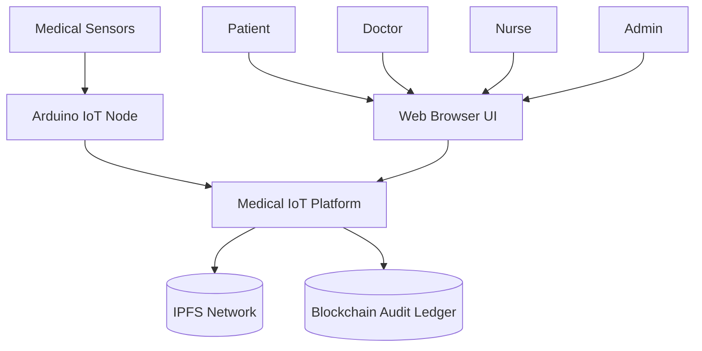
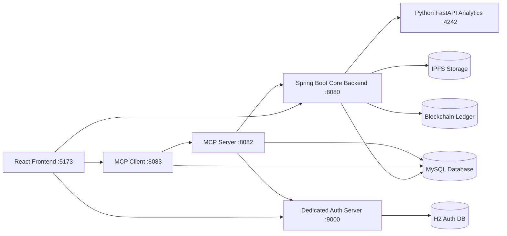
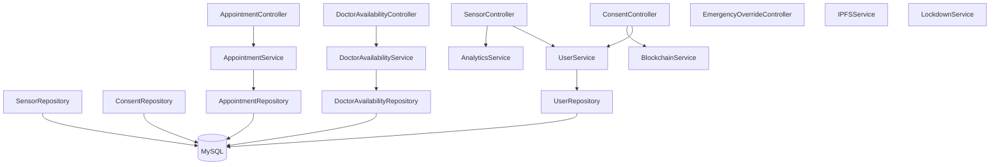
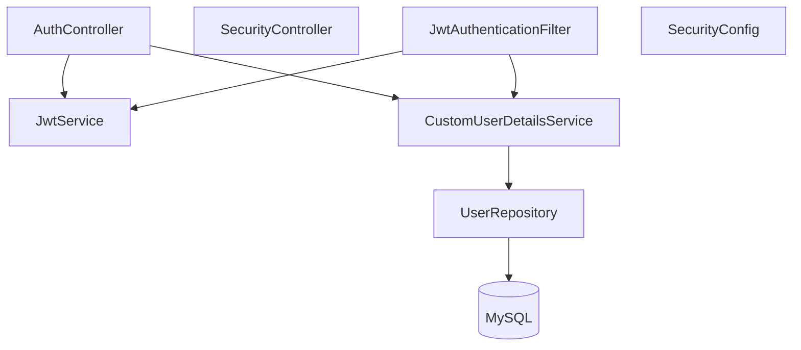
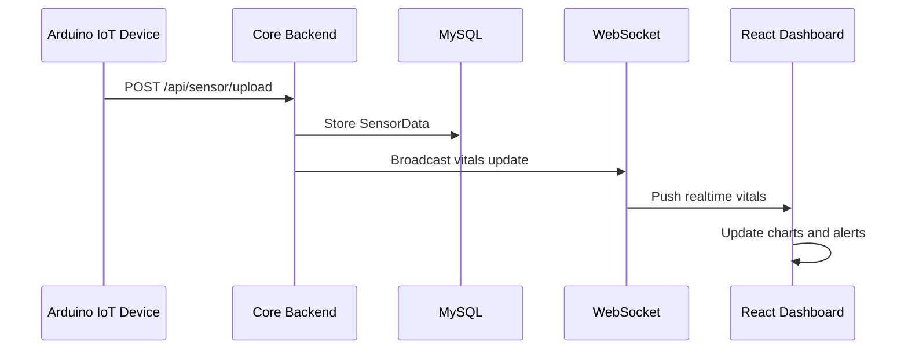
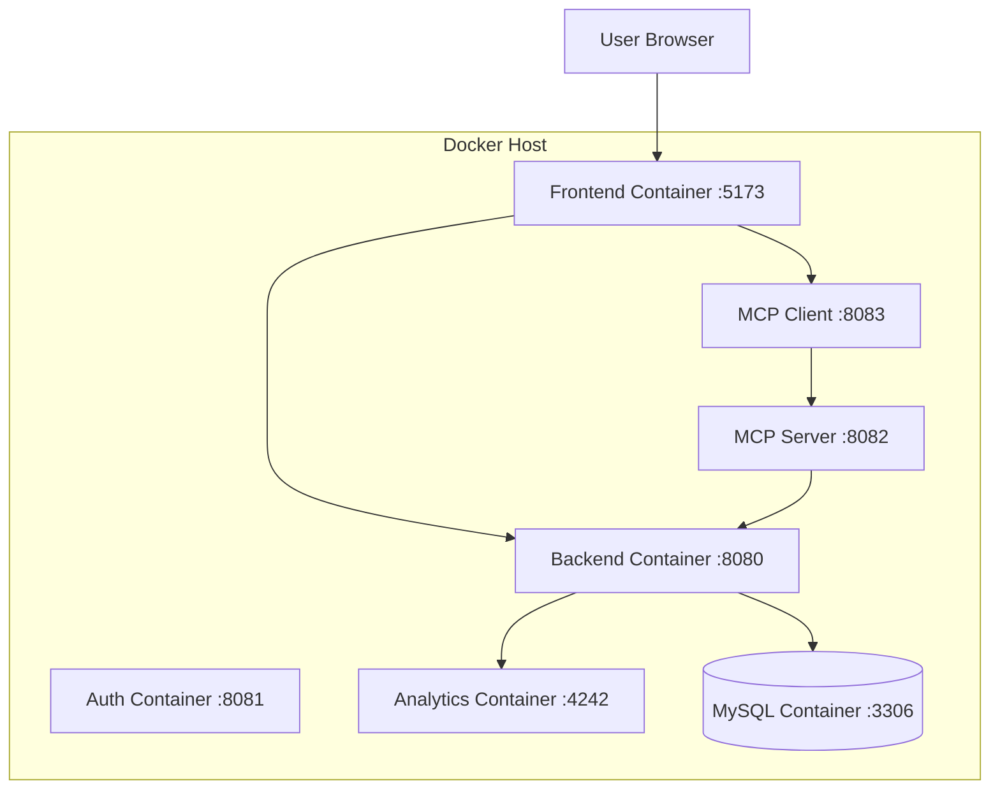
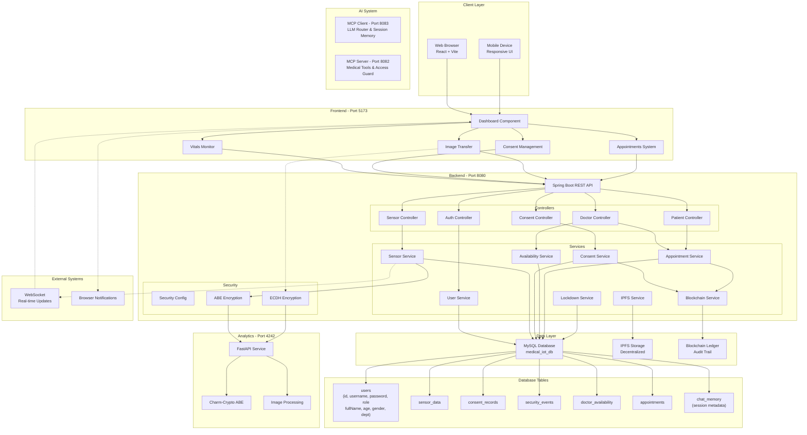

# Medical IoT System - Secure Health Monitoring Platform

A comprehensive, decentralized health monitoring system built with **Spring Boot**, **React**, and **Python** that implements advanced security features including **Attribute-Based Encryption (ABE)**, **ECDH encryption**, **IPFS storage**, and **blockchain logging**.

> **👨‍🔧 For Engineering Review:**
> - **[System Architecture & Signal Processing](./SYSTEM_ARCHITECTURE.md)**: Detailed breakdown of sensor interfacing, signal conditioning, and communication protocols.
> - **[Firmware Source Code](./firmware/medical_iot_node)**: Arduino Uno R4 WiFi C++ implementation for MAX30102, DHT22, and AD8232 sensors.

## 🏥 Features

### Core Functionality
- **Real-time Patient Monitoring**: Track vital signs including Heart Rate, SpO2, Temperature, Humidity, and Blood Pressure
- **Multi-Role Dashboard**: Separate interfaces for Doctors, Nurses, and Patients
- **Consent-Based Access Control**: Patients can approve/reject/revoke access requests. (Security: Approval buttons are only accessible to the patient user role).
- **Doctor-Patient Appointments**: Refined appointment system with recurring weekly office hours and instant confirmation messages.
- **Ward Statistics**: Aggregated patient metrics and critical alerts for healthcare staff
- **Enhanced Patient Identity**: Display of full names, ages, and genders alongside patient IDs
- **System Activity Hub**: Dedicated administrator dashboard for tracking all system happenings (logins, bookings, security events)
- **Live Charts**: Real-time trends with dual Y-axis support for comprehensive vital monitoring
- **Security Audit Dashboard**: Real-time visualization of the immutable blockchain ledger and security events

### Security & Privacy
- **Face-ID Biometric 2FA**: AI-powered facial recognition using `face-api.js` for authorizing critical medical actions (Prescriptions, Completions).
- **Consent-Verified AI Tools**: AI assistants (GPT/Groq) now verify doctor-patient consent before accessing any medical records. (Tool-level security).
- **Memory-Aware Medical Assistant**: Persistent chat history allowing the AI to remember context across conversations.
- **Attribute-Based Encryption (ABE)**: Fine-grained access control for patient data
- **ECDH Image Encryption**: Secure medical image transfer with scrambling
- **IPFS Integration**: Decentralized storage for encrypted health records
- **Blockchain Logging**: SHA-256 linked immutable audit trail for all data access events
- **Emergency Override**: Break-glass access with automatic blockchain logging
- **Intrusion Detection**: Automated system lockdown on security threats

### Advanced Features
- **Browser Notifications**: Real-time critical alerts for abnormal vitals
- **CSV Data Export**: Download patient vital history for offline analysis
- **Mobile Responsive**: Optimized for tablets and smartphones
- **Dark/Light Theme**: User-customizable interface
- **Performance Metrics**: Real-time system benchmarks

## 🔐 Environment Variables (.env)

The system uses a central `.env` file in the root directory to store sensitive information. **Never commit your `.env` file to version control.**

| Variable | Description | Default |
| :--- | :--- | :--- |
| `DB_PASSWORD` | MySQL Root Password | `<your_password>` |
| `ADMIN_PASSWORD` | System Admin Password | `<your_password>` |
| `SSL_KEYSTORE_PASSWORD` | SSL Certificate Password | `<your_password>` |
| `ANALYTICS_URL` | Analytical Service Endpoint | `http://localhost:4242/analyze` |

## 🛠️ Technology Stack

### Backend
- **Spring Boot 3.x** - REST API and business logic
- **MySQL** - Patient and sensor data storage
- **Maven** - Dependency management

### Frontend
- **React 18** - Modern UI framework
- **Vite** - Fast build tool
- **Chart.js** - Real-time data visualization
- **Axios** - HTTP client

### Edge / Hardware
- **Arduino Uno R4 (WiFi)** - Edge device integration
- **MAX30102** - Pulse Oximetry & Heart Rate sensor
- **DHT22** - Temperature & Humidity sensor
- **AD8232** - ECG Lead monitoring sensor
- **C++ / Arduino** - Firmware logic

## 📋 Prerequisites

- **Java 17+** (for Spring Boot backend)
- **Node.js 16+** (for React frontend)
- **Python 3.8+** (for analytics service)
- **MySQL 8.0+** (database)
- **Maven 3.6+** (build tool)
- **Docker Desktop** (Optional, for containerized deployment)

## 🚀 Quick Start

### ⚡ Automated Setup (Recommended for Windows)
To automatically install all dependencies and build the project, run the provided PowerShell script as an **Administrator**:

```powershell
.\setup_environment.ps1
```
*This will detect/install Java, Node, Python, Maven, and MySQL, then build all projects.*

### 🛠️ Manual Setup

### 1. Database Setup

Create the MySQL database:

```sql
CREATE DATABASE medical_iot_db;
CREATE USER 'root'@'localhost' IDENTIFIED BY '*******';
GRANT ALL PRIVILEGES ON medical_iot_db.* TO 'root'@'localhost';
FLUSH PRIVILEGES;
```

### 2. Microservices Setup

**Terminal 1: Core Backend**
```bash
cd backend-spring
mvn clean install
mvn spring-boot:run
```
*(Runs on http://localhost:8080 - Business Logic)*

**Terminal 2: Auth Server**
```bash
cd medical-auth-server
mvn clean install
mvn spring-boot:run
```
*(Runs on http://localhost:9000 - Dedicated Authentication & Biometric Portal)*

**Terminal 3: AI MCP Server**
```bash
cd ai/mcp-server
mvn clean install
mvn spring-boot:run
```
*(Runs on http://localhost:8082)*

**Terminal 4: AI MCP Client**
```bash
cd ai/mcp-client
mvn clean install
mvn spring-boot:run
```
*(Runs on http://localhost:8083)*

### 3. Analytics Service Setup

```bash
cd analytics-python
pip install -r requirements.txt
uvicorn main:app --reload --port 4242
```

The analytics service will start on `http://localhost:4242`

### 4. Admin Setup (Auth Port)
Ensure Port 9000 is open. The frontend communicates with Port 9000 specifically for Biometric Enrollment and JWT generation.

### 4. Frontend Setup

```bash
cd frontend-dashboard
npm install
npm run dev
```

The frontend will start on `http://localhost:5173`

### 5. Mock Data Generator (Optional)

To simulate patient devices:

```bash
python mock_data_generator.py
```

## 🎯 One-Click Startup

Use the provided batch script to start all 5 services simultaneously:

```bash
run_all.bat
```

To stop all services:

```bash
stop_all.bat
```

## 🐳 Docker Deployment (Recommended)

To run the entire system in isolated containers:

```bash
docker-compose up --build
```

This will automatically start:
- **MySQL Database**: Port 3306
- **Core Backend**: Port 8080
- **AI MCP Server**: Port 8082
- **AI MCP Client**: Port 8083
- **Analytics Service**: Port 4242
- **Frontend Dashboard**: Port 5173

## 📱 Mobile App (APK) Generation

The frontend is optimized for mobile conversion using **Capacitor**. To generate an Android APK:

1. **Install Capacitor**:
   ```bash
   cd frontend-dashboard
   npm install @capacitor/core @capacitor/cli
   npx cap init
   ```
2. **Setup Android**:
   ```bash
   npm run build
   npm install @capacitor/android
   npx cap add android
   ```
3. **Build APK**:
   Open the `android` folder in Android Studio and use **Build > Build APK**.
   *Link your local backend by updating the API URL to your machine's IP address (e.g. http://192.168.x.x:8080).*

To stop the containers:
```bash
docker-compose down
```

## 👥 Default Users

### Doctor
- Username: `doctor_micheal`
- Password: `<your-password>`

### Nurse
- Username: `nurse_sarah`
- Password: `<your-password>`

### Patients
- Username: `patient_001` to `patient_035`
- Password: `<your-password>`

## 🏗️ System Architecture

The Medical IoT platform follows a **secure microservice architecture** integrating IoT devices, distributed services, and decentralized storage.

---

### 1️⃣ System Context


```mermaid
flowchart TD

Patient[Patient]
Doctor[Doctor]
Nurse[Nurse]
Admin[Admin]

Browser[Web Browser UI]

Sensors[Medical Sensors]
Arduino[Arduino IoT Node]

Platform[Medical IoT Platform]

IPFS[(IPFS Network)]
Blockchain[(Blockchain Audit Ledger)]

Patient --> Browser
Doctor --> Browser
Nurse --> Browser
Admin --> Browser

Sensors --> Arduino
Arduino --> Platform

Browser --> Platform

Platform --> IPFS
Platform --> Blockchain
```

---

### 2️⃣ Microservice Architecture


```mermaid
flowchart LR

Frontend[React Frontend :5173]

CoreAPI[Spring Boot Core Backend :8080]
AuthServer[Dedicated Auth Server :9000]

Analytics[Python FastAPI Analytics :4242]

MCPClient[MCP Client :8083]
MCPServer[MCP Server :8082]

MySQL[(MySQL Database)]
H2[(H2 Auth DB)]
IPFS[(IPFS Storage)]
Ledger[(Blockchain Ledger)]

Frontend --> CoreAPI
Frontend --> AuthServer
Frontend --> MCPClient

AuthServer --> H2
CoreAPI --> MySQL
CoreAPI --> Analytics
CoreAPI --> IPFS
CoreAPI --> Ledger

MCPClient --> MCPServer
MCPClient --> MySQL
MCPServer --> CoreAPI
MCPServer --> MySQL
MCPServer --> AuthServer
```

---

### 3️⃣ Backend Architecture


```mermaid
flowchart TD

SensorController
ConsentController
AppointmentController
DoctorAvailabilityController
EmergencyOverrideController

AppointmentService
DoctorAvailabilityService
UserService
IPFSService
BlockchainService
AnalyticsService
LockdownService

SensorRepository
ConsentRepository
AppointmentRepository
DoctorAvailabilityRepository
UserRepository

MySQL[(MySQL)]

SensorController --> AnalyticsService
SensorController --> UserService

ConsentController --> BlockchainService
ConsentController --> UserService

AppointmentController --> AppointmentService
DoctorAvailabilityController --> DoctorAvailabilityService

AppointmentService --> AppointmentRepository
DoctorAvailabilityService --> DoctorAvailabilityRepository
UserService --> UserRepository

SensorRepository --> MySQL
ConsentRepository --> MySQL
AppointmentRepository --> MySQL
DoctorAvailabilityRepository --> MySQL
UserRepository --> MySQL
```

---

### 4️⃣ Authentication Architecture


```mermaid
flowchart TD

AuthController
SecurityController

JwtAuthenticationFilter
JwtService
CustomUserDetailsService
SecurityConfig

UserRepository

MySQL[(MySQL)]

AuthController --> JwtService
AuthController --> CustomUserDetailsService

JwtAuthenticationFilter --> JwtService
JwtAuthenticationFilter --> CustomUserDetailsService

CustomUserDetailsService --> UserRepository

UserRepository --> MySQL
```

---

### 5️⃣ Real-Time Vitals Data Flow


```mermaid
sequenceDiagram

participant Device as Arduino IoT Device
participant Backend as Core Backend
participant DB as MySQL
participant WS as WebSocket
participant UI as React Dashboard

Device->>Backend: POST /api/sensor/upload
Backend->>DB: Store SensorData
Backend->>WS: Broadcast vitals update
WS->>UI: Push realtime vitals
UI->>UI: Update charts and alerts
```

---

### 6️⃣ Deployment Architecture


```mermaid
flowchart TD

Browser[User Browser]

subgraph Docker Host
Frontend[Frontend Container :5173]
CoreBackend[Backend Container :8080]
AuthServer[Auth Container :8081]
Analytics[Analytics Container :4242]
MCPClient[MCP Client :8083]
MCPServer[MCP Server :8082]
MySQL[(MySQL Container :3306)]
end

Browser --> Frontend

Frontend --> CoreBackend
Frontend --> MCPClient

CoreBackend --> MySQL
CoreBackend --> Analytics

MCPClient --> MCPServer
MCPServer --> CoreBackend
```


### 7️⃣ Overall Architecture
## System Architecture Diagram


```mermaid
graph TB
    subgraph "Client Layer"
        WEB["Web Browser<br/>React + Vite"]
        MOBILE["Mobile Device<br/>Responsive UI"]
    end

    subgraph "Frontend - Port 5173"
        DASHBOARD["Dashboard Component"]
        VITALS["Vitals Monitor"]
        CONSENT["Consent Management"]
        IMAGES["Image Transfer"]
        APPT["Appointments System"]
    end

    subgraph "Backend - Port 8080"
        API["Spring Boot REST API"]
        
        subgraph "Controllers"
            AUTH["Auth Controller"]
            SENSOR["Sensor Controller"]
            CONS["Consent Controller"]
            DOC["Doctor Controller"]
            PAT["Patient Controller"]
        end
        
        subgraph "Services"
            USERSVC["User Service"]
            SENSVC["Sensor Service"]
            CONSVC["Consent Service"]
            DOCAVSVC["Availability Service"]
            APPTSVC["Appointment Service"]
            IPFSSVC["IPFS Service"]
            BLOCKSVC["Blockchain Service"]
            LOCKSVC["Lockdown Service"]
        end
        
        subgraph "Security"
            SECCONF["Security Config"]
            ABE["ABE Encryption"]
            ECDH["ECDH Encryption"]
        end
    end
    
    subgraph "AI System"
        MCPCLIENT["MCP Client - Port 8083<br/>LLM Router & Session Memory"]
        MCPSERVER["MCP Server - Port 8082<br/>Medical Tools & Access Guard"]
    end

    subgraph "Analytics - Port 4242"
        FASTAPI["FastAPI Service"]
        CHARM["Charm-Crypto ABE"]
        IMGPROC["Image Processing"]
    end

    subgraph "Data Layer"
        MYSQL["MySQL Database<br/>medical_iot_db"]
        IPFS["IPFS Storage<br/>Decentralized"]
        BLOCKCHAIN["Blockchain Ledger<br/>Audit Trail"]
    end

    subgraph "Database Tables"
        USERS["users<br/>(id, username, password, role<br/>fullName, age, gender, dept)"]
        SENSORS["sensor_data"]
        CONSENTS["consent_records"]
        SECURITY["security_events"]
        DOCAVAIL["doctor_availability"]
        APPOINTMENTS["appointments"]
        MEMORY["chat_memory<br/>(session metadata)"]
    end

    subgraph "External Systems"
        WEBSOCKET["WebSocket<br/>Real-time Updates"]
        NOTIF["Browser Notifications"]
    end

    WEB --> DASHBOARD
    MOBILE --> DASHBOARD
    
    DASHBOARD --> VITALS
    DASHBOARD --> CONSENT
    DASHBOARD --> IMAGES
    DASHBOARD --> APPT
    
    VITALS --> API
    CONSENT --> API
    IMAGES --> API
    APPT --> API
    
    API --> AUTH
    API --> SENSOR
    API --> CONS
    API --> DOC
    API --> PAT
    
    AUTH --> USERSVC
    SENSOR --> SENSVC
    CONS --> CONSVC
    DOC --> DOCAVSVC
    DOC --> APPTSVC
    PAT --> APPTSVC
    
    SENSVC --> ABE
    IMAGES -.-> ECDH
    CONSVC --> BLOCKSVC
    APPTSVC --> BLOCKSVC
    
    USERSVC --> MYSQL
    SENSVC --> MYSQL
    CONSVC --> MYSQL
    DOCAVSVC --> MYSQL
    APPTSVC --> MYSQL
    LOCKSVC --> MYSQL
    
    ABE --> FASTAPI
    ECDH --> FASTAPI
    FASTAPI --> CHARM
    FASTAPI --> IMGPROC
    
    IPFSSVC --> IPFS
    BLOCKSVC --> BLOCKCHAIN
    
    MYSQL --> USERS
    MYSQL --> SENSORS
    MYSQL --> CONSENTS
    MYSQL --> SECURITY
    MYSQL --> DOCAVAIL
    MYSQL --> APPOINTMENTS
    MYSQL --> MEMORY
    
    SENSVC -.-> WEBSOCKET
    WEBSOCKET -.-> DASHBOARD
    DASHBOARD -.-> NOTIF
```

---
### Key Components

**Frontend (React)**
- Multi-role dashboards
- Real-time patient monitoring
- Consent management
- Appointment scheduling
- Secure image transfer

**Backend (Spring Boot)**
- Sensor data ingestion
- Consent enforcement
- Appointment system
- Policy engine
- Security event monitoring

**Analytics Service (Python)**
- Attribute-Based Encryption (ABE)
- ECDH image encryption
- Image processing

**Data Layer**
- MySQL database
- IPFS decentralized storage
- Blockchain audit ledger

**Edge Layer**
- Arduino Uno R4 WiFi
- MAX30102 pulse oximeter
- DHT22 environmental sensor
- AD8232 ECG sensor

### Key Components:

- **Frontend (React)**: Multi-tab dashboard with real-time monitoring
- **Backend (Spring Boot)**: RESTful API with comprehensive security
- **Analytics (Python)**: ABE encryption and image processing
- **Database (MySQL)**: Persistent storage for all entities
- **IPFS**: Decentralized storage for encrypted records
- **Blockchain**: Immutable audit trail for compliance


## 🔐 Security Features

### Consent Management
- Patients control who can access their data
- Three-state consent: Pending, Approved, Rejected
- Revocation capability for approved access

### Encryption Layers
1. **Transport**: HTTPS/TLS
2. **Application**: ABE for data, ECDH for images
3. **Storage**: Encrypted data in IPFS

### Audit Trail
- All access events logged to blockchain
- Emergency overrides tracked
- Intrusion attempts recorded

## 📱 API Endpoints

### Authentication
- `POST /api/auth/login` - User login

### Sensor Data
- `POST /api/sensor/upload` - Upload patient vitals
- `GET /api/sensor/history/{patientId}` - Get patient history

### Consent Management
- `POST /api/consent/request` - Request patient data access
- `POST /api/consent/respond` - Approve/reject access request
- `GET /api/consent/patient/{patientId}` - Get all consent requests
- `GET /api/consent/check` - Check consent status

### Patient Management
- `GET /api/patients` - List all patients (with pagination)

### Appointment System (NEW)

#### Doctor Endpoints
- `POST /api/doctor/set-availability` - Set recurring weekly office hours (e.g., MONDAY 10:00-18:00)
- `GET /api/doctor/{doctorId}/slots` - Get office hours for a doctor
- `GET /api/doctor/appointments` - Get all appointments for a doctor
- `POST /api/doctor/appointments/{appointmentId}/complete` - Mark appointment as completed
- `POST /api/doctor/slots/{slotId}/cancel` - Remove an office hour entry

#### Patient Endpoints
- `GET /api/patient/all-doctors` - Get list of all doctors
- `GET /api/patient/all-doctors/{doctorId}/slots` - View doctor office hours
- `POST /api/patient/book-appointment` - Book an appointment for a specific date/time
- `GET /api/patient/appointments` - Get all patient appointments
- `POST /api/patient/appointments/{appointmentId}/cancel` - Cancel an appointment

### Chat Memory (NEW)
- `GET /api/chat-memory` - Get list of past conversations for the user
- `GET /api/chat-memory/{chatId}` - Retrieve full message history for a specific session
- `POST /api/chat-memory/start` - Initialize a new conversation with AI-generated title
- `POST /api/chat-memory/{chatId}` - Continue a session with context-aware memory

### Emergency
- `POST /api/emergency/override` - Break-glass access

### Export
- `GET /api/export/logs/csv` - Download audit logs

## 🎨 Screenshots

### Doctor Dashboard
- Ward-wide statistics
- Patient vital monitoring
- Consent request management

### Patient Dashboard
- Personal vital trends
- Consent management interface
- Secure image transfer

## 🧪 Testing

### Run Mock Data Generator
Simulates 35 patient devices sending real-time vitals:

```bash
python mock_data_generator.py
```

### Test Consent Flow
1. Login as doctor → Request access to patient
2. Login as patient → Approve/reject request
3. Login as doctor → View patient data (if approved)

### Test Appointment System (Refactored)
1. **Doctor sets office hours**:
   ```bash
   curl -X POST http://localhost:8080/api/doctor/set-availability \
     -H "Content-Type: application/json" \
     -H "X-User-Id: doctor_micheal" \
     -d '{"dayOfWeek": "MONDAY", "startTime": "10:00:00", "endTime": "18:00:00"}'
   ```

2. **Patient views doctor hours**:
   ```bash
   curl http://localhost:8080/api/patient/all-doctors/doctor_micheal/slots
   ```

3. **Patient books appointment**:
   ```bash
   curl -X POST http://localhost:8080/api/patient/book-appointment \
     -H "Content-Type: application/json" \
     -H "X-User-Id: patient_001" \
     -d '{"doctorId": 1, "appointmentTime": "2025-06-30T10:30:00"}'
   ```

4. **Doctor completes appointment**:
   ```bash
   curl -X POST http://localhost:8080/api/doctor/appointments/1/complete \
     -H "X-User-Id: doctor_micheal"
   ```

## 📈 Performance

- **Encryption**: ~50ms average
- **Decryption**: ~45ms average
- **API Latency**: ~30ms average
- **Throughput**: 20+ requests/second

## 🤝 Contributing

This is an academic project for demonstration purposes. All rights reserved. See the [LICENSE](./LICENSE) file for more information.

## 👨‍💻 Authors (Project Team)

*Malcolm Cephas*
- GitHub: [@malcolm-cephas](https://github.com/malcolm-cephas)
  
*Shalini Sinha*
- GitHub: [@Shalini-sinha-codes](https://github.com/shalini-sinha-codes)
  
*A B Vishvajeeth*
- GitHub: [@ABVishvajeeth](https://github.com/ABVishvajeeth) 

## 🙏 Acknowledgments

- Built as part of Major Project at DSCE
- Uses Charm-Crypto library for ABE implementation
- Inspired by modern healthcare security requirements

### AI & Architecture References
- [SpringAI_Test](https://github.com/malcolm-cephas/SpringAI_Test) - MCP Client/Server Architecture
- [opencode-antigravity-autopilot](https://github.com/Gooseware/opencode-antigravity-autopilot) - Model Switching Inspiration
- [Building an AI Chat with Memory (Context) using Spring AI and Angular](https://loiane.com/2025/10/building-ai-chat-with-memory-using-spring-ai-and-angular/)
- [Chat Memory in Spring AI](https://www.baeldung.com/spring-ai-chat-memory)
- [Securing MCP Servers with Spring AI](https://spring.io/blog/2025/09/30/spring-ai-mcp-server-security)
- [Securing Spring AI MCP Servers With OAuth2](https://www.baeldung.com/spring-ai-mcp-servers-oauth2)
  
---

## 📚 Documentation

- **[APPOINTMENT_SYSTEM.md](./APPOINTMENT_SYSTEM.md)** - Complete guide for the appointment scheduling system inspired from doctor patient api (includes Quick Start)
- **[DATABASE_SETUP.md](./DATABASE_SETUP.md)** - Database configuration and setup instructions
- **[MULTI_DEVICE_ACCESS.md](./MULTI_DEVICE_ACCESS.md)** - Guide for accessing the system from multiple devices
- **[Doctor-Patient-API](https://github.com/MarcusFranklin-GIT/doctor-patient-api)** - Original NestJS repository (adapted for this project)

---
## Traceable Watermark Feature

**Inspired by:** "Building an Invisible Shield to Enable Traceable Privacy Protection for Medical Images in Telemedicine" — Wenying Wen et al., IEEE TCSVT 2026

---

### Why We Need This in Our Framework

Our Medical IoT system transmits sensitive patient medical images from local hospitals to remote specialist doctors over the internet. The existing system uses:
- **ABE Encryption** — controls WHO can access the image (access control)
- **Blockchain logging** — logs who accessed what

**The Gap:** ABE secures the door. But once a doctor legitimately downloads the image, ABE's job is over. If that doctor leaks the image — shares it on WhatsApp, emails it, sells it — there is NO way to prove who leaked it. The system logs only show "doctor accessed file" which is normal behaviour.

**Watermarking fills this gap** — it travels WITH the image after download.

---

### Where It Fits in the System Flow
Patient scan captured at local clinic
↓
Uploaded to IPFS (decentralised storage)
↓
Doctor requests image via our platform
↓
Backend fetches from IPFS
↓
★ WatermarkService embeds doctor's 64-bit ID invisibly  ← THIS IS THE NEW STEP
↓
Watermarked image delivered to doctor (looks identical)
↓
If image is found leaked anywhere:
Admin uploads to /api/watermark/decode → identifies exactly whose copy was leaked

---

### How It Works (Technical)

1. Doctor's username is converted into a stable **64-bit binary fingerprint**
   - Example: "doctor123" → `0000000000000000010100000110111...` (64 bits)

2. These 64 bits are embedded into **specific pixels spread evenly across the image**
   - Only the **Least Significant Bit (LSB)** of the blue channel is changed
   - A change from pixel value 200 → 201 is **completely invisible to the human eye**
   - This is called **LSB Steganography**

3. The image is returned as PNG (lossless) to preserve exact pixel values

4. If leaked — admin uploads the suspicious image to `/api/watermark/decode`
   - System reads the LSB of the same pixel positions
   - Reconstructs the 64-bit fingerprint
   - Matches it to the doctor's ID → **source identified**

---

### New API Endpoints

| Method | URL | Purpose |
|--------|-----|---------|
| GET | `/api/watermark/health` | Check feature is active |
| POST | `/api/watermark/embed` | Embed doctor ID invisibly into image |
| POST | `/api/watermark/verify` | Confirm which doctor's copy this is |
| POST | `/api/watermark/decode` | Extract hidden 64-bit fingerprint |

---

### Postman Demo Results

**Test 1 — Feature Active**
- `GET /api/watermark/health` → `"status": "ACTIVE"` ✅

**Test 2 — Embed (Invisibility)**
- `POST /api/watermark/embed` with medical image + `doctorId=doctor123`
- Returns watermarked image — visually identical to original ✅

**Test 3 — Verify Correct Doctor (Traceability)**
- `POST /api/watermark/verify` with watermarked image + `doctorId=doctor123`
- Returns `"match": true` ✅

**Test 4 — Verify Wrong Doctor (Security)**
- `POST /api/watermark/verify` with same image + `doctorId=doctor456`
- Returns `"match": false` ✅

**Test 5 — Decode Fingerprint**
- `POST /api/watermark/decode` with watermarked image
- Returns `"extracted_bits": "0000000000000000010100000110111..."` (64-bit fingerprint) ✅

---

### Difference from Base Paper

| Base Paper | Our Implementation |
|---|---|
| Deep learning neural network encoder | LSB pixel manipulation |
| Trained on medical datasets (GPU required) | Works on any image, no training needed |
| Python/PyTorch | Java/Spring Boot |
| Research prototype | Integrated into live Medical IoT backend |

> Our implementation is inspired by the **concept** of receiver identity embedding for traceability — not a copy of the paper's neural network approach.

## 📄 License

Copyright (c) 2026 Malcolm Cephas, Shalini Sinha, A B Vishvajeeth. All Rights Reserved.

This project is proprietary and for academic review only. Unauthorized use or distribution is prohibited.

---

**⚠️ Note**: This is a prototype system. For production use, additional security hardening, compliance certifications (HIPAA, GDPR), and professional security audits are required.
