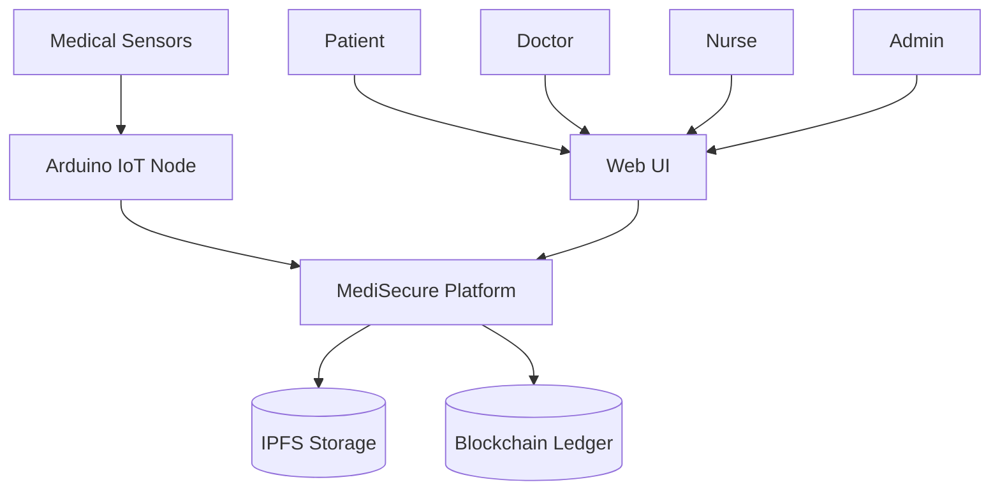
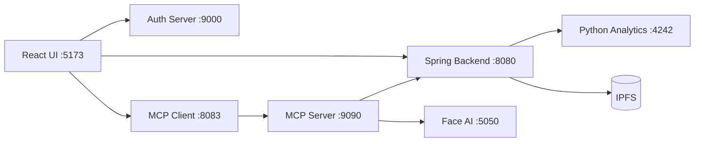
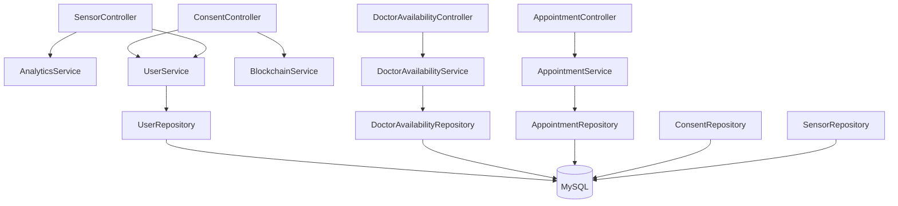
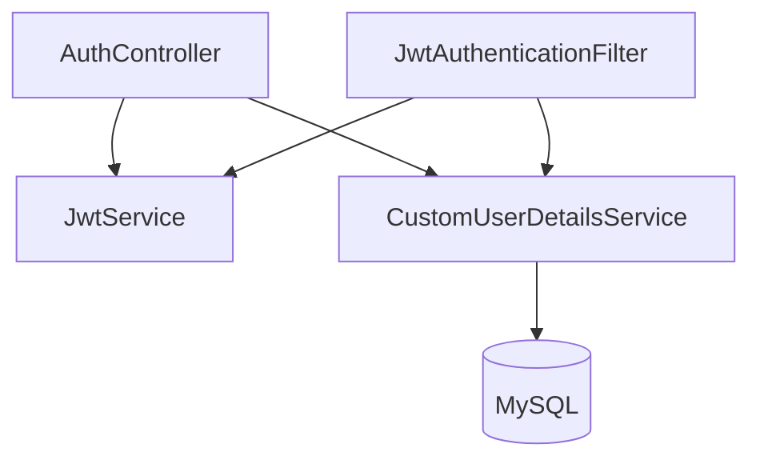
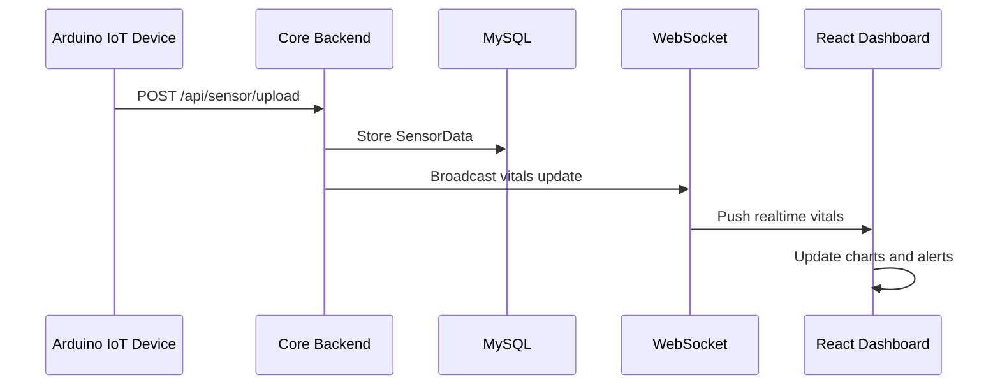
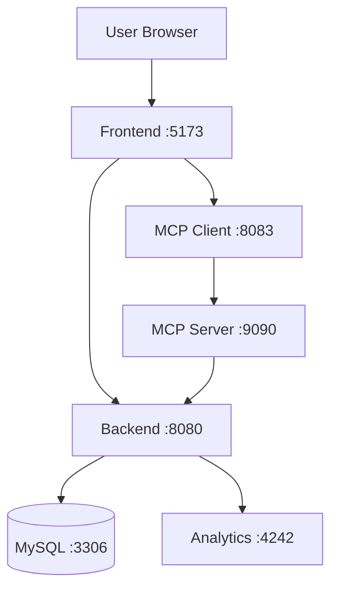
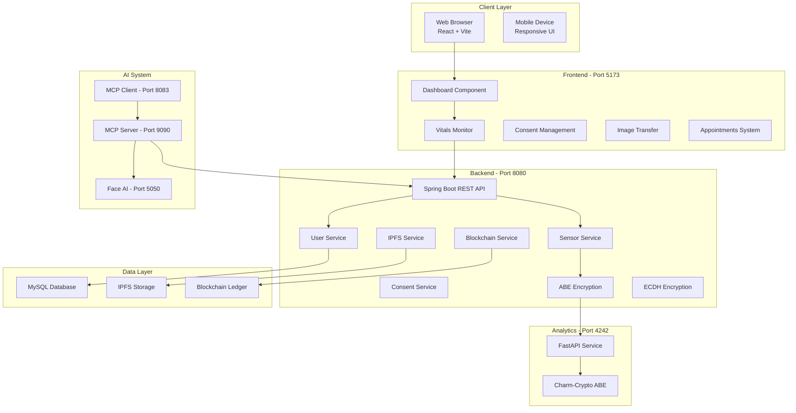

# MediSecure IoT 🏥
### Secure, Decentralized & AI-Enhanced Health Monitoring Platform


MediSecure IoT is a comprehensive medical monitoring framework designed to secure patient data from the sensor to the specialist's screen. It integrates real-time vitals tracking with cutting-edge privacy technologies like **Attribute-Based Encryption (ABE)**, **Traceable Invisible Watermarking**, **Face-ID Biometrics**, and **Blockchain Auditing**.

---

## 📑 Table of Contents
1. [Core Features](#-core-features)
2. [Technology Stack](#-technology-stack)
3. [Technical Architecture](#-technical-architecture)
4. [Service Ecosystem](#-service-ecosystem)
5. [Quick Start](#-quick-start)
6. [Detailed Installation](#-detailed-installation)
7. [Security Deep-Dive](#-security-deep-dive)
8. [API Reference](#-api-reference)
9. [Testing & Performance](#-testing--performance)
10. [Documentation & Authors](#-documentation--authors)

---

## 🏥 Core Features

### 📡 Real-Time Monitoring
- **Vitals Tracking**: Heart Rate, SpO2, Temperature, Humidity, and Blood Pressure.
- **Live Dashboards**: Interactive charts with dual Y-axis support and real-time WebSocket updates.
- **Critical Alerts**: Browser-based notifications for abnormal vital sign thresholds.

### 🔐 Advanced Security & Privacy
- **Traceable Watermarking**: Invisible identity embedding in medical images for leak traceability (IEEE TCSVT 2026 inspired).
- **Face-ID Biometric 2FA**: AI-powered facial recognition for authorizing sensitive medical actions (Prescriptions, Completions).
- **Consent Control**: Granular patient-driven access management (Approve/Reject/Revoke).
- **Hybrid Encryption**: ABE for granular vitals access and ECDH for secure image scrambling.
- **Immutable Ledger**: SHA-256 blockchain audit trail logging every data access event.

### 🤖 AI Integration (MCP)
- **Medical Assistant**: Context-aware AI (GPT/Groq) with persistent chat memory.
- **Access Guards**: AI tools that automatically verify consent before accessing medical records.
- **Analytics Engine**: Time-series analysis for vital sign trend prediction.

---

## 🛠️ Technology Stack

| Layer | Technologies |
| :--- | :--- |
| **Frontend** | React 18, Vite, Chart.js, TailwindCSS, SockJS |
| **Backend** | Spring Boot 3.x, Spring Data JPA, Spring Security |
| **AI/Analytics** | Python 3.8+, FastAPI, Uvicorn, Face-API.js, HOG/CNN Models |
| **Data & Security** | MySQL 8.0, IPFS (Kubo), Charm-Crypto (ABE), Blockchain (Java implementation) |
| **Hardware** | Arduino Uno R4 WiFi, MAX30102, DHT22, AD8232 |

---

## 🏗️ Technical Architecture

### 1. System Context & Roles

```mermaid
flowchart TD
    Patient[Patient] --> Browser[Web UI]
    Doctor[Doctor] --> Browser
    Nurse[Nurse] --> Browser
    Admin[Admin] --> Browser

    Sensors[Medical Sensors] --> Arduino[Arduino IoT Node]
    Arduino --> Platform[MediSecure Platform]

    Browser --> Platform
    Platform --> IPFS[(IPFS Storage)]
    Platform --> Blockchain[(Blockchain Ledger)]
```

### 2. Microservice Interaction Flow (Ports & Communication)

```mermaid
flowchart LR
    Frontend[React UI :5173] --> CoreAPI[Spring Backend :8080]
    Frontend --> AuthServer[Auth Server :9000]
    Frontend --> MCPClient[MCP Client :8083]

    CoreAPI --> Analytics[Python Analytics :4242]
    CoreAPI --> IPFS[(IPFS)]
    
    MCPClient --> MCPServer[MCP Server :9090]
    MCPServer --> CoreAPI
    MCPServer --> FaceService[Face AI :5050]
```

### 3. Backend Service Internal Architecture

```mermaid
flowchart TD
    SensorController --> AnalyticsService
    SensorController --> UserService
    ConsentController --> BlockchainService
    ConsentController --> UserService
    AppointmentController --> AppointmentService
    DoctorAvailabilityController --> DoctorAvailabilityService
    
    AppointmentService --> AppointmentRepository
    DoctorAvailabilityService --> DoctorAvailabilityRepository
    UserService --> UserRepository
    
    SensorRepository --> MySQL[(MySQL)]
    ConsentRepository --> MySQL
    AppointmentRepository --> MySQL
    DoctorAvailabilityRepository --> MySQL
    UserRepository --> MySQL
```

### 4. Dedicated Authentication & 2FA Flow

```mermaid
flowchart TD
    AuthController --> JwtService
    AuthController --> CustomUserDetailsService
    JwtAuthenticationFilter --> JwtService
    JwtAuthenticationFilter --> CustomUserDetailsService
    CustomUserDetailsService --> UserRepository[(MySQL)]
```

### 5. Real-Time Vitals Propagation (WebSocket)

```mermaid
sequenceDiagram
    participant Device as Arduino IoT Device
    participant Backend as Core Backend
    participant DB as MySQL
    participant WS as WebSocket
    participant UI as React Dashboard
    
    Device->>Backend: POST /api/sensor/upload
    Backend->>DB: Store SensorData
    Backend->>WS: Broadcast vitals update
    WS->>UI: Push realtime vitals
    UI->>UI: Update charts and alerts
```

### 6. Deployment Topology (Docker Containers)

```mermaid
flowchart TD
    Browser[User Browser] --> Frontend[Frontend :5173]
    Frontend --> CoreBackend[Backend :8080]
    Frontend --> MCPClient[MCP Client :8083]
    CoreBackend --> MySQL[(MySQL :3306)]
    CoreBackend --> Analytics[Analytics :4242]
    MCPClient --> MCPServer[MCP Server :9090]
    MCPServer --> CoreBackend
```

### 7. Comprehensive Overall Architecture

```mermaid
graph TB
    subgraph "Client Layer"
        WEB["Web Browser<br/>React + Vite"]
        MOBILE["Mobile Device<br/>Responsive UI"]
    end
    subgraph "Frontend - Port 5173"
        DASHBOARD["Dashboard Component"]
        VITALS["Vitals Monitor"]
        CONSENT["Consent Management"]
        IMAGES["Image Transfer"]
        APPT["Appointments System"]
    end
    subgraph "Backend - Port 8080"
        API["Spring Boot REST API"]
        USERSVC["User Service"]
        SENSVC["Sensor Service"]
        CONSVC["Consent Service"]
        IPFSSVC["IPFS Service"]
        BLOCKSVC["Blockchain Service"]
        ABE["ABE Encryption"]
        ECDH["ECDH Encryption"]
    end
    subgraph "AI System"
        MCPCLIENT["MCP Client - Port 8083"]
        MCPSERVER["MCP Server - Port 9090"]
        FACE["Face AI - Port 5050"]
    end
    subgraph "Analytics - Port 4242"
        FASTAPI["FastAPI Service"]
        CHARM["Charm-Crypto ABE"]
    end
    subgraph "Data Layer"
        MYSQL["MySQL Database"]
        IPFS["IPFS Storage"]
        BLOCKCHAIN["Blockchain Ledger"]
    end

    WEB --> DASHBOARD
    DASHBOARD --> VITALS
    VITALS --> API
    API --> USERSVC
    API --> SENSVC
    SENSVC --> ABE
    ABE --> FASTAPI
    FASTAPI --> CHARM
    IPFSSVC --> IPFS
    BLOCKSVC --> BLOCKCHAIN
    USERSVC --> MYSQL
    MCPCLIENT --> MCPSERVER
    MCPSERVER --> API
    MCPSERVER --> FACE
```

---

## 🌐 Service Ecosystem

| Service | Port | Directory | Description |
| :--- | :--- | :--- | :--- |
| **Frontend** | `5173` | `frontend-dashboard` | React Dashboard (Vite) |
| **Main Backend** | `8080` | `backend-spring` | Business Logic & Data Ingestion |
| **Auth Server** | `9000` | `medical-auth-server` | JWT & Biometric Portal |
| **MCP Server** | `9090` | `ai/mcp-server` | Medical AI Tools |
| **MCP Client** | `8083` | `ai/mcp-client` | LLM Router & Memory |
| **Analytics** | `4242` | `analytics-python` | ABE & Image Processing |
| **Face AI** | `5050` | `ai-face-service` | Biometric Models |

---

## 🚀 Quick Start

### ⚡ Automated Startup (Windows)
Run the master batch script to launch all 7 services in separate terminals:
```bash
run_all.bat
```
To restart/clean the system: `relaunch_all.bat` | To stop: `stop_all.bat`

### 🐳 Docker Deployment
```bash
docker-compose up --build
```

---

## 🛠️ Detailed Installation

### 1. Environment Setup
Create a `.env` file in the root directory:
```env
DB_PASSWORD=your_mysql_password
ADMIN_PASSWORD=your_admin_password
SSL_KEYSTORE_PASSWORD=your_ssl_password
```

### 2. Database Initialization
```sql
CREATE DATABASE medical_iot_db;
CREATE USER 'root'@'localhost' IDENTIFIED BY 'your_password';
GRANT ALL PRIVILEGES ON medical_iot_db.* TO 'root'@'localhost';
```

### 3. Service Manual Launch (Sequence)
1.  **Analytics**: `cd analytics-python && pip install -r requirements.txt && uvicorn main:app --port 4242`
2.  **Auth Server**: `cd medical-auth-server && mvn spring-boot:run`
3.  **MCP Server**: `cd ai/mcp-server && mvn spring-boot:run`
4.  **MCP Client**: `cd ai/mcp-client && mvn spring-boot:run`
5.  **Face AI**: `cd ai-face-service && python app.py`
6.  **Core Backend**: `cd backend-spring && mvn spring-boot:run`
7.  **Frontend**: `cd frontend-dashboard && npm install && npm run dev`

---

## 🛡️ Security Deep-Dive

### Traceable Watermark Feature
**Inspired by:** *"Building an Invisible Shield for Medical Images"* — IEEE TCSVT 2026.
*   **Problem**: ECDH secures transmission, but doesn't prevent authorized doctors from leaking images.
*   **Solution**: Every image download via `/api/medical-records/stream/{cid}` is automatically embedded with a hidden 64-bit fingerprint of the doctor's identity using LSB steganography.
*   **Forensics**: Admins can use `/api/watermark/decode` on any leaked image to identify the exact source.

### Face-ID Biometric 2FA
*   Sensitive actions (e.g., issuing prescriptions) trigger a biometric challenge.
*   Uses HOG/CNN models to match the live capture against the Auth Server's stored identity.

### Attribute-Based Encryption (ABE)
*   Vital signs are encrypted using attributes (e.g., `ROLE:DOCTOR`, `DEPT:CARDIOLOGY`).
*   Only users with matching keys can decrypt and view specific patient parameters.

---

## 📱 API Reference (Partial)

### 🩺 Appointments
- `POST /api/doctor/set-availability` - Configure office hours.
- `GET /api/patient/all-doctors/{id}/slots` - View available times.
- `POST /api/patient/book-appointment` - Book a session (JSON body).

### 🤖 AI Assistant
- `POST /api/chat-memory/start` - Initialize new AI session.
- `POST /api/chat-memory/{chatId}` - Chat with persistent context.

### 🧪 Watermarking
- `POST /api/watermark/embed` - Manual watermark embedding.
- `POST /api/watermark/verify` - Confirm doctor identity in image.

---

## 🧪 Testing & Performance

### Mock Data Generation
Simulate 35 IoT devices sending real-time data:
```bash
python mock_data_generator.py
```

### Performance Benchmarks
- **Encryption**: ~50ms avg
- **API Latency**: ~30ms avg
- **Throughput**: 20+ req/sec (Concurrent IoT Streams)

---

## 👨‍💻 Authors & Documentation

### Project Team
- **Malcolm Cephas** ([@malcolm-cephas](https://github.com/malcolm-cephas))
- **Shalini Sinha** ([@Shalini-sinha-codes](https://github.com/shalini-sinha-codes))
- **A B Vishvajeeth** ([@ABVishvajeeth](https://github.com/ABVishvajeeth))

### Extended Guides
- **[APPOINTMENT_SYSTEM.md](./APPOINTMENT_SYSTEM.md)** - Scheduling logic & flow.
- **[DATABASE_SETUP.md](./DATABASE_SETUP.md)** - Schema details & user seeding.
- **[SYSTEM_ARCHITECTURE.md](./SYSTEM_ARCHITECTURE.md)** - Signal processing & engineering.
- **[MULTI_DEVICE_ACCESS.md](./MULTI_DEVICE_ACCESS.md)** - Network configuration guide.

---
## Traceable Watermark Feature

**Inspired by:** "Building an Invisible Shield to Enable Traceable Privacy Protection for Medical Images in Telemedicine" — Wenying Wen et al., IEEE TCSVT 2026

---

### Why We Need This in Our Framework

Our Medical IoT system transmits sensitive patient medical images from local hospitals to remote specialist doctors over the internet. The existing system uses:
- **ECDH Encryption** — secures medical image transfer during transmission
- **ABE Encryption** — controls fine-grained access to patient vital signs data
- **Blockchain logging** — logs who accessed what

**The Gap:** ECDH secures the image during transmission. But once a doctor legitimately downloads the image, ECDH's job is over. If that doctor leaks the image — shares it on WhatsApp, emails it, sells it — there is NO way to prove who leaked it. Blockchain logs only show "doctor accessed file" which is normal behaviour.

---

### Where It Fits in the System Flow

```
Patient scan captured at local clinic
        ↓
Uploaded to IPFS (decentralised storage)
        ↓
Doctor requests image via our platform
        ↓
Backend fetches from IPFS
        ↓
★ WatermarkService embeds doctor's 64-bit ID invisibly  ← THIS IS THE NEW STEP
        ↓
Watermarked image delivered to doctor (looks identical)
        ↓
If image is found leaked anywhere:
Admin uploads to /api/watermark/decode → identifies exactly whose copy was leaked

```
---

### How It Works (Technical)

1. Doctor's username is converted into a stable **64-bit binary fingerprint**
   - Example: "doctor123" → `0000000000000000010100000110111...` (64 bits)

2. These 64 bits are embedded into **specific pixels spread evenly across the image**
   - Only the **Least Significant Bit (LSB)** of the blue channel is changed
   - A change from pixel value 200 → 201 is **completely invisible to the human eye**
   - This is called **LSB Steganography**

3. The image is returned as PNG (lossless) to preserve exact pixel values

4. If leaked — admin uploads the suspicious image to `/api/watermark/decode`
   - System reads the LSB of the same pixel positions
   - Reconstructs the 64-bit fingerprint
   - Matches it to the doctor's ID → **source identified**

---

### New API Endpoints

| Method | URL | Purpose |
|--------|-----|---------|
| GET | `/api/watermark/health` | Check feature is active |
| POST | `/api/watermark/embed` | Embed doctor ID invisibly into image |
| POST | `/api/watermark/verify` | Confirm which doctor's copy this is |
| POST | `/api/watermark/decode` | Extract hidden 64-bit fingerprint |

---

### Postman Demo Results

**Test 1 — Feature Active**
- `GET /api/watermark/health` → `"status": "ACTIVE"` ✅

**Test 2 — Embed (Invisibility)**
- `POST /api/watermark/embed` with medical image + `doctorId=doctor123`
- Returns watermarked image — visually identical to original ✅

**Test 3 — Verify Correct Doctor (Traceability)**
- `POST /api/watermark/verify` with watermarked image + `doctorId=doctor123`
- Returns `"match": true` ✅

**Test 4 — Verify Wrong Doctor (Security)**
- `POST /api/watermark/verify` with same image + `doctorId=doctor456`
- Returns `"match": false` ✅

**Test 5 — Decode Fingerprint**
- `POST /api/watermark/decode` with watermarked image
- Returns `"extracted_bits": "0000000000000000010100000110111..."` (64-bit fingerprint) ✅

---

### Difference from Base Paper

| Base Paper | Our Implementation |
|---|---|
| Deep learning neural network encoder | LSB pixel manipulation |
| Trained on medical datasets (GPU required) | Works on any image, no training needed |
| Python/PyTorch | Java/Spring Boot |
| Research prototype | Integrated into live Medical IoT backend |

> Our implementation is inspired by the **concept** of receiver identity embedding for traceability — not a copy of the paper's neural network approach.

## 📄 License
Copyright © 2026 Project Team. All Rights Reserved. 
*Academic prototype - Production use requires HIPAA/GDPR compliance auditing.*

---
> **👨‍🔧 Engineering Note**: Firmware sources for Arduino IoT nodes are located in the `/firmware` directory.
