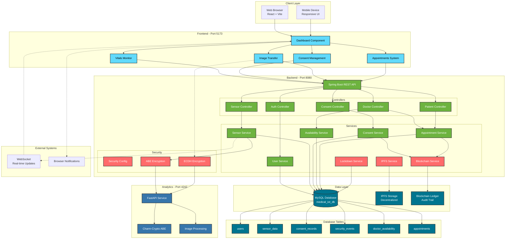

# Medical IoT System - Secure Health Monitoring Platform

A comprehensive, decentralized health monitoring system built with **Spring Boot**, **React**, and **Python** that implements advanced security features including **Attribute-Based Encryption (ABE)**, **ECDH encryption**, **IPFS storage**, and **blockchain logging**.

## 🏥 Features

### Core Functionality
- **Real-time Patient Monitoring**: Track vital signs including Heart Rate, SpO2, Temperature, Humidity, and Blood Pressure
- **Multi-Role Dashboard**: Separate interfaces for Doctors, Nurses, and Patients
- **Consent-Based Access Control**: Patients can approve/reject/revoke access requests from healthcare providers
- **Doctor-Patient Appointments**: Complete appointment scheduling system with availability management
- **Ward Statistics**: Aggregated patient metrics and critical alerts for healthcare staff
- **Live Charts**: Real-time trends with dual Y-axis support for comprehensive vital monitoring

### Security & Privacy
- **Attribute-Based Encryption (ABE)**: Fine-grained access control for patient data
- **ECDH Image Encryption**: Secure medical image transfer with scrambling
- **IPFS Integration**: Decentralized storage for encrypted health records
- **Blockchain Logging**: Immutable audit trail for all data access events
- **Emergency Override**: Break-glass access with automatic blockchain logging
- **Intrusion Detection**: Automated system lockdown on security threats

### Advanced Features
- **Browser Notifications**: Real-time critical alerts for abnormal vitals
- **CSV Data Export**: Download patient vital history for offline analysis
- **Mobile Responsive**: Optimized for tablets and smartphones
- **Dark/Light Theme**: User-customizable interface
- **Performance Metrics**: Real-time system benchmarks

## 🛠️ Technology Stack

### Backend
- **Spring Boot 3.x** - REST API and business logic
- **MySQL** - Patient and sensor data storage
- **Maven** - Dependency management

### Frontend
- **React 18** - Modern UI framework
- **Vite** - Fast build tool
- **Chart.js** - Real-time data visualization
- **Axios** - HTTP client

### Analytics Service
- **Python 3.x** - FastAPI service
- **Charm-Crypto** - ABE encryption
- **Pillow** - Image processing
- **NumPy** - Numerical operations

## 📋 Prerequisites

- **Java 17+** (for Spring Boot backend)
- **Node.js 16+** (for React frontend)
- **Python 3.8+** (for analytics service)
- **MySQL 8.0+** (database)
- **Maven 3.6+** (build tool)

## 🚀 Quick Start

### 1. Database Setup

Create the MySQL database:

```sql
CREATE DATABASE medical_iot_db;
CREATE USER 'root'@'localhost' IDENTIFIED BY '*******';
GRANT ALL PRIVILEGES ON medical_iot_db.* TO 'root'@'localhost';
FLUSH PRIVILEGES;
```

### 2. Backend Setup

```bash
cd backend-spring
mvn clean install
mvn spring-boot:run
```

The backend will start on `http://localhost:8080`

### 3. Analytics Service Setup

```bash
cd analytics-python
pip install -r requirements.txt
uvicorn main:app --reload --port 4242
```

The analytics service will start on `http://localhost:4242`

### 4. Frontend Setup

```bash
cd frontend-dashboard
npm install
npm run dev
```

The frontend will start on `http://localhost:5173`

### 5. Mock Data Generator (Optional)

To simulate patient devices:

```bash
python mock_data_generator.py
```

## 🎯 One-Click Startup

Use the provided batch script to start all services:

```bash
run_all.bat
```

To stop all services:

```bash
stop_all.bat
```

## 👥 Default Users

### Doctor
- Username: `doctor_micheal`
- Password: `password`

### Nurse
- Username: `nurse_sarah`
- Password: `password`

### Patients
- Username: `patient_001` to `patient_035`
- Password: `password`

## 🏗️ System Architecture



### Key Components:

- **Frontend (React)**: Multi-tab dashboard with real-time monitoring
- **Backend (Spring Boot)**: RESTful API with comprehensive security
- **Analytics (Python)**: ABE encryption and image processing
- **Database (MySQL)**: Persistent storage for all entities
- **IPFS**: Decentralized storage for encrypted records
- **Blockchain**: Added Security Immutable audit trail for compliance


## 🔐 Security Features

### Consent Management
- Patients control who can access their data
- Three-state consent: Pending, Approved, Rejected
- Revocation capability for approved access

### Encryption Layers
1. **Transport**: HTTPS/TLS
2. **Application**: ABE for data, ECDH for images
3. **Storage**: Encrypted data in IPFS

### Audit Trail
- All access events logged to blockchain
- Emergency overrides tracked
- Intrusion attempts recorded

## 📱 API Endpoints

### Authentication
- `POST /api/auth/login` - User login

### Sensor Data
- `POST /api/sensor/upload` - Upload patient vitals
- `GET /api/sensor/history/{patientId}` - Get patient history

### Consent Management
- `POST /api/consent/request` - Request patient data access
- `POST /api/consent/respond` - Approve/reject access request
- `GET /api/consent/patient/{patientId}` - Get all consent requests
- `GET /api/consent/check` - Check consent status

### Patient Management
- `GET /api/patients` - List all patients (with pagination)

### Appointment System (NEW)

#### Doctor Endpoints
- `POST /api/doctor/set-availability` - Set doctor availability slots
- `GET /api/doctor/{doctorId}/slots` - Get available slots for a doctor
- `GET /api/doctor/appointments` - Get all appointments for a doctor
- `POST /api/doctor/appointments/{appointmentId}/complete` - Mark appointment as completed
- `POST /api/doctor/slots/{slotId}/cancel` - Cancel an availability slot

#### Patient Endpoints
- `GET /api/patient/all-doctors` - Get list of all doctors
- `GET /api/patient/all-doctors/{doctorId}/slots` - View available slots for a doctor
- `POST /api/patient/book-appointment/{slotId}` - Book an appointment
- `GET /api/patient/appointments` - Get all patient appointments
- `POST /api/patient/appointments/{appointmentId}/cancel` - Cancel an appointment

### Emergency
- `POST /api/emergency/override` - Break-glass access

### Export
- `GET /api/export/logs/csv` - Download audit logs

## 🎨 Screenshots

### Doctor Dashboard
- Ward-wide statistics
- Patient vital monitoring
- Consent request management

### Patient Dashboard
- Personal vital trends
- Consent management interface
- Secure image transfer

## 🧪 Testing

### Run Mock Data Generator
Simulates 35 patient devices sending real-time vitals:

```bash
python mock_data_generator.py
```

### Test Consent Flow
1. Login as doctor → Request access to patient
2. Login as patient → Approve/reject request
3. Login as doctor → View patient data (if approved)

### Test Appointment System (NEW)
1. **Doctor sets availability**:
   ```bash
   curl -X POST http://localhost:8080/api/doctor/set-availability \
     -H "Content-Type: application/json" \
     -H "X-User-Id: doctor_micheal" \
     -d '{"fromTime": "2025-06-29T09:00:00", "toTime": "2025-06-29T17:00:00"}'
   ```

2. **Patient views available doctors**:
   ```bash
   curl http://localhost:8080/api/patient/all-doctors
   ```

3. **Patient views doctor slots**:
   ```bash
   curl http://localhost:8080/api/patient/all-doctors/doctor_micheal/slots
   ```

4. **Patient books appointment**:
   ```bash
   curl -X POST http://localhost:8080/api/patient/book-appointment/1 \
     -H "X-User-Id: patient_alpha"
   ```

5. **Doctor completes appointment**:
   ```bash
   curl -X POST http://localhost:8080/api/doctor/appointments/1/complete \
     -H "X-User-Id: doctor_micheal"
   ```

## 📈 Performance

- **Encryption**: ~50ms average
- **Decryption**: ~45ms average
- **API Latency**: ~30ms average
- **Throughput**: 20+ requests/second

## 🤝 Contributing

This is an academic project for demonstration purposes. Feel free to fork and extend!

## 📄 License

This project is for educational purposes only.

## 👨‍💻 Author

**Malcolm Cephas**
- GitHub: [@malcolm-cephas](https://github.com/malcolm-cephas)
  
**Shalini Sinha**
- GitHub: [@Shalini-git-hub](https://github.com/Shalini-git-hub)
  
**A B Vishvajeeth**
- GitHub: [@ABVishvajeeth](https://github.com/ABVishvajeeth) 

## 🙏 Acknowledgments

- Built as part of Major Project at DSCE
- Uses Charm-Crypto library for ABE implementation
- Inspired by modern healthcare security requirements
  
---

## 📚 Documentation

- **[APPOINTMENT_SYSTEM.md](./APPOINTMENT_SYSTEM.md)** - Complete guide for the appointment scheduling system inspired from doctor patient api (includes Quick Start)
- **[DATABASE_SETUP.md](./DATABASE_SETUP.md)** - Database configuration and setup instructions
- **[MULTI_DEVICE_ACCESS.md](./MULTI_DEVICE_ACCESS.md)** - Guide for accessing the system from multiple devices
- **[Doctor-Patient-API](https://github.com/MarcusFranklin-GIT/doctor-patient-api)** - Original NestJS repository (adapted for this project)

---

**⚠️ Note**: This is a prototype system. For production use, additional security hardening, compliance certifications (HIPAA, GDPR), and professional security audits are required.
**⚠️ Note**: This is a prototype system. For production use, additional security hardening, compliance certifications (HIPAA, GDPR), and professional security audits are required.
